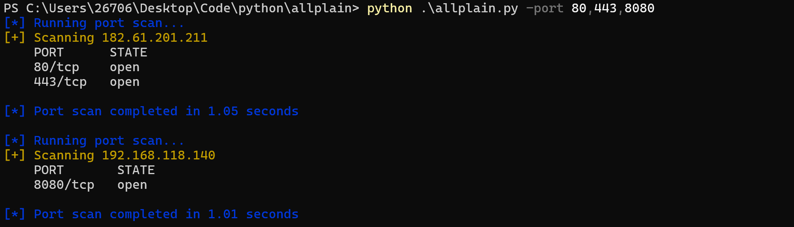

# Allplain 网络扫描与漏洞评估框架

Allplain 是一个高度集成的网络扫描与漏洞评估工具，通过模块化设计实现了从基础主机发现到高级漏洞验证的完整安全评估流程。该工具结合了Nmap式的智能扫描技术与ExploitDB漏洞数据库，为安全研究人员提供了一站式的网络资产探测和漏洞验证解决方案。

## 核心功能

1. **主机存活探测**：基于ICMP协议的快速主机发现
2. **智能端口扫描**：
   - TCP SYN扫描（半开扫描）
   - UDP端口扫描
   - 支持自定义端口范围和全端口扫描
3. **服务指纹识别**：
   - 基于Nmap指纹数据库（4000+规则）
   - 轻量级（TOP 100端口）和全面（TOP 1000端口）扫描模式
   - SSL/TLS服务自动检测
4. **漏洞POC管理**：
   - ExploitDB漏洞数据库检索
   - 语义化版本范围匹配（如">1.0,<2.0"）
5. **漏洞验证**：
   - 独立PoC执行沙箱
   - 响应关键词自动分析
   - 超时保护机制

## 安装指南

1. 克隆仓库：

   ```
   git clone https://github.com/yourusername/allplain.git
   cd allplain
   ```

2. 安装依赖：

   ```
   pip install -r requirements.txt
   ```

3. 下载依赖数据文件：

   ```
   wget https://raw.githubusercontent.com/nmap/nmap/master/nmap-service-probes -O dependent_files/nmap-service-probes
   wget https://raw.githubusercontent.com/nmap/nmap/master/nmap-services -O dependent_files/nmap-services
   ```

## 使用示例

### 基础扫描流程

```
# 1. 主机发现
python .\allplain.py -alive

# 2. 端口扫描 (TOP 1000端口)
python .\allplain.py-port 1-1000

# 3. 服务探测 (轻量模式)
python .\allplain.py --version-light

# 4. 漏洞检索
python .\allplain.py -searchsploit Apache Tomcat 8.5.1

# 5. 漏洞验证
python .\allplain.py --poc-test -target 192.168.118.140 -payload exploitdb/webapps/12345.py
```





## 参数说明

| 参数                    | 描述                                 |
| :---------------------- | :----------------------------------- |
| `-alive`                | 执行主机存活探测                     |
| `-port <ports>`         | 扫描指定端口（支持1-100,80,443格式） |
| `-allports`             | 扫描所有65535个端口                  |
| `--version-light`       | 轻量级服务识别（TOP 100端口）        |
| `--version-all`         | 全面服务识别（TOP 1000端口）         |
| `-f <file>`             | 指定目标文件（默认targets.txt）      |
| `-thread <num>`         | 设置并发线程数（默认100）            |
| `-searchsploit <query>` | 漏洞POC检索                          |
| `--poc-test`            | 执行漏洞验证                         |
| `-target <IP:PORT>`     | 漏洞验证目标                         |
| `-payload <path>`       | PoC文件路径                          |

## 注意事项

1. **权限要求**：
   - TCP SYN扫描需要root权限
   - 原始套接字操作可能需要sudo
2. **漏洞验证**：
   - PoC执行在隔离环境中进行
   - 生产环境测试前务必在授权环境中验证
3. **网络影响**：
   - 大范围扫描可能触发安全设备告警
   - 建议在授权网络环境中使用